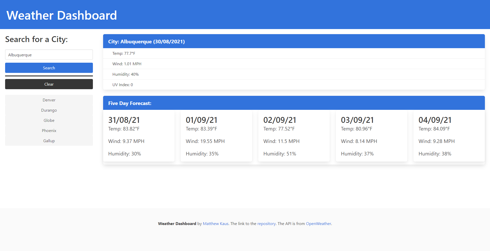

# Weather Dashboard
URL to this repository https://github.com/LifeInvaderr/Weather-Dashboard

URL to the deployed repository https://lifeinvaderr.github.io/Weather-Dashboard/

## Description
Weather Dashboard allwows users to look up Towns and cities for the present forecast aswell as a five day forecast.

## Table of Contents
* [Technologies](#technologies)
* [Installation](#installation)
* [Usage](#usage)
* [Questions](#questions)
* [Updates](#updates)

## Technologies
* Javascript
* JQuery
* HTML5
* CSS - Bulma
* API

## Installation
To install this repository, please either clone or install the zip version.

## Usage
With Weather Dashboard, users have the ability to search for cities for a five day forecast. 

## Updates
Future updates planned are to ensure the functionality of local storage on the search history. To ensure that the searched city is added in realtime, as well as the clear option to remove the searched items

## Questions
For any questions or concerns, please email me at matthewkausfox@gmail.com

Thank you!
